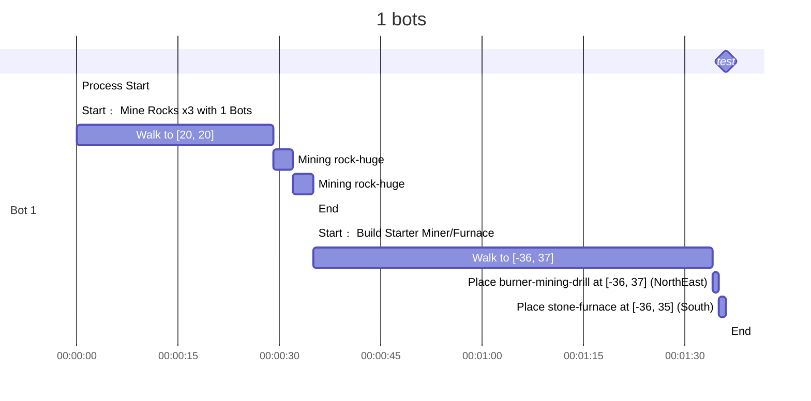

```mermaid
gantt
    title 1 bots
    dateFormat HH:mm:ss
    axisFormat %H:%M:%S
    test : milestone, m1, 00:01:36,0s
    section Bot 1
    Process Start : 00:00:00,0s
    Start﹕ Mine Rocks x3 with 1 Bots : 0s
    Walk to [20, 20] : 29s
    Mining rock-huge : 3s
    Mining rock-huge : 3s
    End : 0s
    Start﹕ Build Starter Miner/Furnace : 0s
    Walk to [-36, 37] : 59s
    Place burner-mining-drill at [-36, 37] (NorthEast) : 1s
    Place stone-furnace at [-36, 35] (South) : 1s
    End : 0s

```
