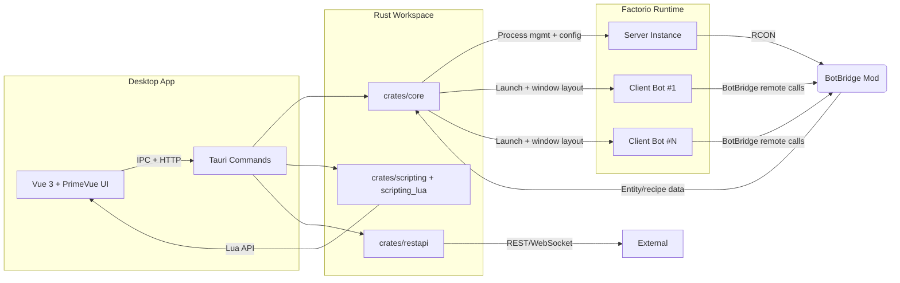
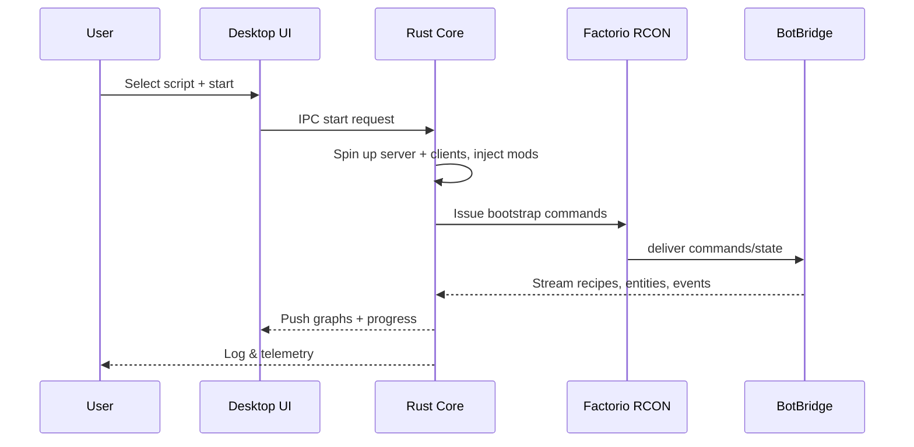

## Architecture

Factorio Bot orchestrates a local Factorio server plus N scripted clients, captures world state via the bundled BotBridge mod, and exposes that information to Lua scripts, REST consumers, and the Vue/Tauri desktop UI. The following sections summarize how the pieces fit together today and what has to happen next to reach fully goal-driven automation.

### Component map

### Runtime loop

### Subsystems (Rust workspace)
- **`crates/core`**: Owns launching Factorio binaries, configuring saves/mod sets, scheduling tasks, and building domain graphs (entity/flow/task). Provides graph traversal utilities (`graph/`, `plan/`, `process/`) and shared data models in `types.rs`.
- **`crates/scripting` + `crates/scripting_lua`**: Wrap Lua (via `mlua`) and expose typed host functions so scripts can queue tasks, query graphs, or issue direct commands. Also contains the REPL/minimal runtime used for smoke tests.
- **`crates/restapi`**: Optional HTTP API (OpenAPI documented) that mirrors the Lua controls for remote automation and monitoring.
- **`src-tauri`**: IPC boundary for the desktop app. Commands forward to the Rust workspace, debounce UI requests, and proxy file-system interactions (config, scripts, mod archives).

### Factorio orchestration
- **Bootstrap**: The user selects a Factorio ZIP/tar and mods; `core` unpacks/links assets per instance, applies settings, and spawns one headless server plus `N` graphical clients. Windows are laid out so multiple bots stay visible.
- **BotBridge mod**: Runs in every instance, exposes RPC-like APIs over RCON to read prototypes (recipes, items, entities), world snapshots, and to enqueue “tasks” (build, craft, move, research). It also emits events consumed by the graph builders.
- **Command surface**: RCON is the single control channel. The core crate batches script intentions into idempotent commands so that repeated calls remain safe.

### Graph views
| Graph | Purpose | Source data | Example uses |
| --- | --- | --- | --- |
| Entity graph | Spatial relationship of entities with distance weights | BotBridge entity snapshots | Find nearest resource patch, detect chokepoints |
| Flow graph | Throughput along belts/inserters per side/resource | Recipe + machine stats + entity graph | Balance material flows, detect bottlenecks |
| Task graph | Bot task DAG with time estimates | Script planner + execution telemetry | Parallelize crafting/research, surface critical path |

Graph updates are incremental: RCON deltas update local caches, then the affected subgraphs are recomputed and sent to the UI (Mermaid, canvas overlays) and scripting layer.

### Lua automation path
1. User writes `<workspace>/scripts/*.lua` using the Monaco editor embedded in the app.
2. `scripting_lua` loads the script, injects helper libs from `scripts/lib.lua`, and validates against the exposed API (see docs/lua).
3. The script schedules goals ("mine plates", "research automation") which map to predefined or user-defined planners.
4. Planners expand goals into task graph nodes; executor assigns nodes to clients based on availability, predicted travel time, and current inventory.
5. Execution feedback (success, failure, ETA) flows back to Lua so scripts can adapt.

### Current limitations
- Task planners still rely on hand-written heuristics; only basic tasks (move, craft, research first technologies) are reliable.
- No persistent knowledge graph yet—world state must be recomputed per session.
- Goals are imperative; scripts express every action instead of declaring desired end states.

### Roadmap

#### Short-term MVP (first research end-to-end)
- Deliverables: deterministic bootstrap, repeatable set of starter scripts, baseline graphs surfaced in UI.
- Dependencies: stable BotBridge schema, Factorio binary management, task executor telemetry.
- Suggested prompts:
  - `Document BotBridge data flow and entity/flow/task graphs` (for dev guide completeness).
  - `Add smoke test that runs "research automation" script headlessly`.
  - `Wire task graph events into Vue gantt view`.

#### Mid-term automation (goal-aware planning)
- Deliverables: recipe knowledge graph, supply/demand planner, dynamic task queue rebalancing, REST hooks for external planners.
- Dependencies: MVP telemetry, serialized world snapshots, Lua API coverage.
- Suggested prompts:
  1. `Implement recipe knowledge graph service in crates/core`.
  2. `Add planner heuristic to decompose "research automation" into craft/build tasks`.
  3. `Expose executor queue over REST with pagination`.

#### Long-term autonomy (user-defined high-level goals)
- Deliverables: declarative goal DSL ("research automation tech"), goal decomposition pipeline, feedback control loop, learning hooks (ML agents or heuristics), multi-bot coordination strategies.
- Dependencies: mid-term planners, robust persistence, telemetry aggregation.
- Suggested prompts:
  1. `Design goal decomposition pipeline that maps research goals to recipe/task graphs`.
  2. `Integrate feedback loop so bots adjust when tasks stall`.
  3. `Prototype multi-bot assignment strategy using Hungarian algorithm on task graph weights`.

### Where to go next
- Validate BotBridge APIs against the current Factorio release and document any mod-specific quirks in `docs/devguide/src/useful_links.md`.
- Flesh out the Lua API reference with real-world examples so contributors can script richer goals sooner.
- Instrument execution paths (`crates/core/process`) to capture metrics the planner will need (travel time distributions, craft success rates).
