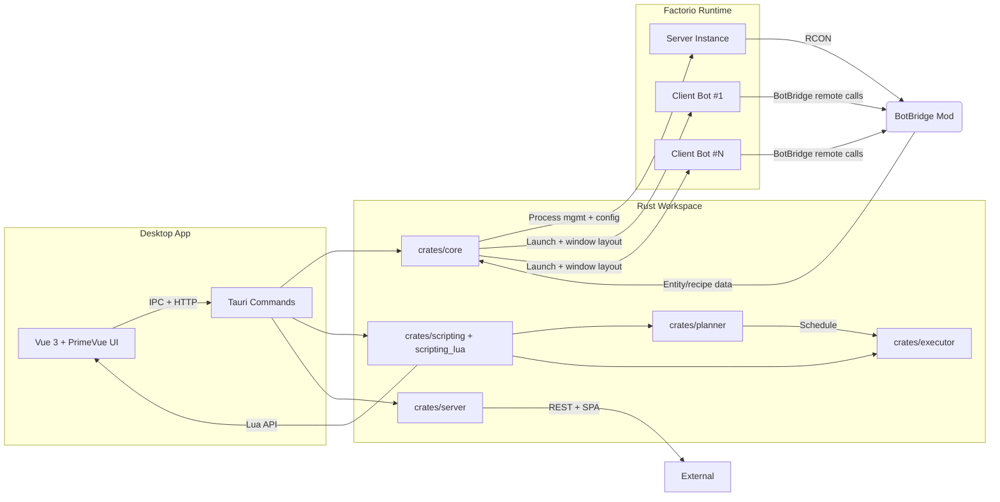
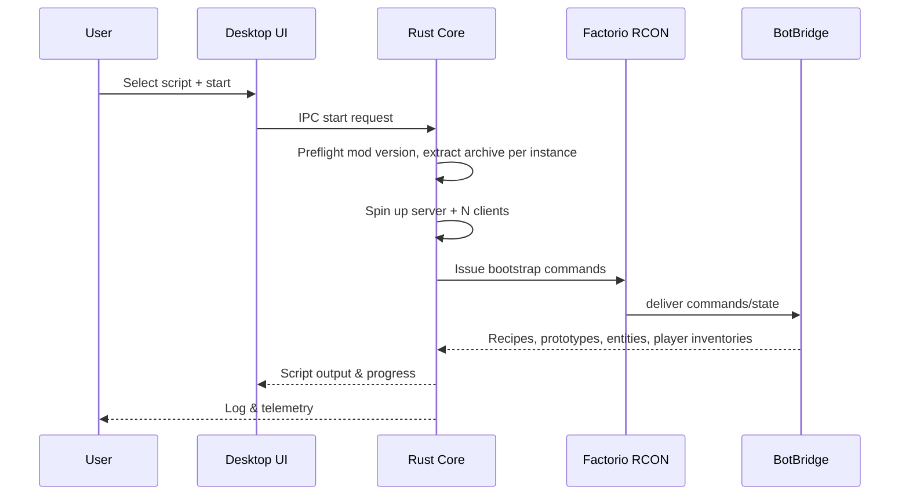

## Architecture

Factorio Bot orchestrates a local Factorio server plus N scripted clients, captures world state via the bundled BotBridge mod, and exposes that information to Lua scripts, REST consumers, and the Vue/Tauri desktop UI. The following sections summarize how the pieces fit together today and what has to happen next to reach fully goal-driven automation.

### Component map

```mermaid
graph LR
    subgraph Desktop App
        A[Vue 3 + PrimeVue UI] -->|IPC + HTTP| B[Tauri Commands]
    end
    subgraph Rust Workspace
        B --> C[crates/core]
        B --> D[crates/scripting + scripting_lua]
        B --> E[crates/server]
        D --> P[crates/planner]
        D --> X[crates/executor]
        P -->|Schedule| X
    end
    subgraph Factorio Runtime
        F[Server Instance]
        G[Client Bot #1]
        H[Client Bot #N]
    end
    C -->|Process mgmt + config| F
    C -->|Launch + window layout| G
    C -->|Launch + window layout| H
    F -->|RCON| I(BotBridge Mod)
    G -->|BotBridge remote calls| I
    H -->|BotBridge remote calls| I
    I -->|Entity/recipe data| C
    D -->|Lua API| A
    E -->|REST + SPA| External
```

### Runtime loop

```mermaid
sequenceDiagram
    participant User
    participant UI as Desktop UI
    participant Core as Rust Core
    participant RCON as Factorio RCON
    participant Mod as BotBridge

    User->>UI: Select script + start
    UI->>Core: IPC start request
    Core->>Core: Preflight mod version, extract archive per instance
    Core->>Core: Spin up server + N clients
    Core->>RCON: Issue bootstrap commands
    RCON->>Mod: deliver commands/state
    Mod-->>Core: Recipes, prototypes, entities, player inventories
    Core-->>UI: Script output & progress
    Core-->>User: Log & telemetry
```

The desktop app is not the only entry point: the same `Context` is driven from
the CLI (`factorio-bot lua`, `start`, `serve`, `rcon`, `repl`, `roll-seed`,
`config`) and, for `serve`, from the HTTP API. `app/src-tauri/src/cli/`
assembles the clap command; each subcommand is a `Subcommand` impl.

### Subsystems (Rust workspace)
- **`crates/core`**: Owns launching Factorio binaries, configuring saves/mod sets, RCON, and the world model. `graph/` holds the entity and flow graphs, `process/` the instance setup and process control, `types.rs` the shared data models. `plan/planner.rs` survives only as a context holder (`real_world`, `plan_world`, `initiate_missing_players_with_default_inventory`); the search that used to live next to it is gone.
- **`crates/planner`**: Pure, deterministic goal decomposition. No I/O — no tokio, no RCON, no filesystem — and `BTreeMap`/`BTreeSet` throughout, so the same inputs always produce the same plan. See below.
- **`crates/executor`**: Runs a `Schedule` across bots over RCON. Depends on `planner` for the plan types and on `core` for RCON. See below.
- **`crates/scripting` + `crates/scripting_lua`**: Wrap Lua (via `mlua`) and expose typed host functions so scripts can declare goals, query the world, or issue direct RCON commands. `scripting_lua` is the only crate that depends on both `planner` and `executor`. Also contains the REPL/minimal runtime used for smoke tests.
- **`crates/server`**: axum HTTP server that mirrors the Lua controls for remote automation and monitoring. Routes and the OpenAPI spec are generated together with `utoipa`/`utoipa-axum` (Swagger UI at `/swagger-ui`, spec at `/openapi.json`), and the same server also serves the built Vue SPA from the configured web root.
- **`app/src-tauri`**: the shipped binary. It is both the Tauri IPC boundary for the desktop app and the host of the CLI (`src/cli/`) and the shared `Context`. Cargo features split the two: `default = ["gui", "restapi", "repl", "cli", "lua"]`, only `gui` pulls Tauri in, so `--no-default-features --features cli,lua` builds a binary with no Tauri and no GUI toolkit dependency. That is the shape `just factorio` (`cli,repl`), `just lua` (`cli,lua`) and `cargo repl` (`repl,lua,tokio-console`) all build.

### Factorio orchestration
- **Bootstrap**: The user configures a Factorio ZIP/tar (`factorio.factorio_archive_path`); the mods are not chosen, they ship with the project. `core` unpacks/links assets per instance, applies settings, runs `preflight_mod_factorio_version`, and spawns one server plus `N` graphical clients. `arrange_windows` lays the client windows out — but its body is `#[cfg(windows)]`, so on Linux and macOS it is a no-op.
- **BotBridge mod**: Runs in every instance and exposes RPC-like APIs over RCON to read prototypes (recipes, items, entities), world snapshots and player inventories, and to act (walk, mine, craft, place, insert, remove, research).
- **Command surface**: RCON is the single control channel, and commands are **not** uniformly idempotent — `insert`, `remove` and `place` visibly double if repeated. Retry policy is the executor's `recover` tiers, not a property of the commands.

### Graph views
| Graph | Purpose | Source data | Example uses |
| --- | --- | --- | --- |
| Entity graph | Spatial relationship of entities with distance weights | BotBridge entity snapshots | Find nearest resource patch, detect chokepoints |
| Flow graph | Throughput along belts/inserters per side/resource | Recipe + machine stats + entity graph | Balance material flows, detect bottlenecks |

Both live on `FactorioWorld` (`crates/core/src/factorio/world.rs`), which is what
`crates/core/src/graph/{entity_graph,flow_graph}.rs` build. The planner reads
them through `PlanState` (`crates/planner/src/state.rs`) rather than touching
them directly.

There is **no task graph**. `crates/core/src/graph/task_graph.rs`,
`plan/plan_builder.rs` and `plan/execute.rs` were deleted together with the Lua
`plan.*` global; `goal.*` and the planner/executor pair below replace them.
The plan's own DAG is now `ActionNetwork`, which lives only in memory for the
duration of a run.

### Lua automation path
1. User writes `<workspace>/scripts/*.lua` using the Monaco editor embedded in the app.
2. `scripting_lua` loads the script, injects helper libs from `scripts/lib.lua`, and validates against the exposed API (see docs/lua).
3. The script declares a goal value — `goal.have("iron-plate", 5)`, `goal.researched("automation")` — a plain Lua table the planner has not looked at yet.
4. `goal.plan(goal, opts)` expands the goal into an `ActionNetwork` and schedules it against one roster in a single call, returning a `PlanValue` (`plan.makespan`, `plan.steps`, `plan:graphviz()`, `plan:gantt(title)`, ...).
5. `goal.start(plan)` hands the schedule to the executor and returns a `RunValue` immediately; `run:progress()` polls it and `run:wait()` blocks on it. `goal.run(plan)` is `goal.start(plan):wait()` in one call.

### Planning: `crates/planner`

`Goal` → `expand()` → `ActionNetwork` → `schedule()` → `Schedule`.

- **`Goal`** has four variants: `Have { item, count, whose }`, `Researched(String)`, `Producing { item, rate }` and `All(Vec<Goal>)`. `Producing` has no method yet — blueprint generation is a later increment, and a test pins that it is unsatisfiable today.
- **`expand(goals, state, registry, chain_actor) -> Result<ActionNetwork, PlannerError>`** drives HTN-style decomposition. Methods live in `crates/planner/src/method/`: `mod.rs` holds the vocabulary (`trait Method`, `Step`, `MethodRegistry`, `MAX_EXPANSION_DEPTH`), `util.rs` holds pure lookups over `PlanState`, and `have.rs` holds every concrete method — `AlreadySatisfied`, `SplitAcrossBots`, `Smelt`, `HandCraft`, `Mine`, `Researched`. First applicable method in registration order wins; `registry_for(bots)` is the multi-bot registry, `default_registry()` the single-bot one.
- **`ActionNetwork`** is a partially ordered set of actions plus `Edge { from, to, lag }`. No bot appears in it: a `ChainId` says which actions must share a runner, never which bot that is. `lag` is machine time — a furnace's smelting time — expressed as the minimum ticks after `from` finishes before `to` may start. `validate()` rejects a cyclic network.
- **`schedule(net, state, bots) -> Result<Schedule, PlannerError>`** is a greedy, travel-aware list scheduler and a pure function of its three arguments; ties break on `(end, action, bot)` ascending, so output is stable across runs. A `Schedule` is `Vec<ScheduledStep>` plus a `makespan`, where each step is a `Walk` or an `Act` with a bot and a tick range.

A network is only schedulable on the roster it was expanded for, because
`SplitAcrossBots` sizes each share against the holdings of the bot it names.
`goal.plan` expands and schedules against the same roster in one call, which is
what makes that mismatch unrepresentable from Lua.

### Execution: `crates/executor`

`run_into(actuator, schedule, network, log)` runs the schedule. One future per
bot (`futures::future::join_all` over a `BTreeSet<BotId>`, so future order is a
function of the schedule alone), each walking its own steps in schedule order.

- **Completion signals.** One `tokio::sync::watch` channel per action, carrying `Status` (`Pending | Running | Success | Failed`). A bot waits on its predecessors' channels instead of polling; this replaced a 100 ms poll loop.
- **Lag edges.** After every predecessor reports `Success`, the waiter sleeps the *maximum* lag across those edges — once, not a sum — converted at 60 ticks per second. The bot has walked away but the furnace has not finished. Known limitation: a server at non-default `game.speed` makes that conversion wrong.
- **Wait-graph cycle rejection.** `check_wait_graph` topologically sorts the union of the network's edges *and* the schedule's per-bot successor edges, over scheduled actions only, and fails with `ExecutionError::CircularWait` before a single command reaches the game. The planner's own `validate()` cannot catch this: a network holding `1 -> 0` is acyclic, yet a bot scheduled to run `0` then `1` waits on itself forever.
- **Actuator seam.** `trait Actuator` (`walk`, `mine`, `craft`, `place`, `insert`, `remove`, `research`) is what the tests mock; `RconActuator` is the wire implementation. `research` takes no `BotId` because research is server-wide. Bot ids are Factorio player ids and are never renumbered.
- **Recovery** (`recover.rs`) returns a decision as a value; nothing in it talks to the game. Tier 0 `Complete` when no action is unfinished; **tier 1 `Rescheduled`** re-schedules the same plan minus what is already done, keeping action ids so the existing log carries forward, and escalates after `MAX_TIER_ONE_ATTEMPTS` (3) failures of any one action; **tier 2 `Reexpanded`** plans the same goal again from the method layer, producing fresh action ids that require a fresh log and carrying no loop breaker of its own; **tier 3 `Surfaced(Vec<ActionId>)`** hands the failed action ids to a human when nothing mechanical is left.

Retrying is a default, not a guarantee: `Insert`, `Remove` and `Place` are not
idempotent and will visibly double if re-run.

### Debug and release diverge on `mods/` and `scripts/`

A release binary has to be self-contained, so `mods/` and `scripts/` are baked
in with `include_dir!` at compile time
(`crates/core/src/process/instance_setup.rs`) and extracted into the workspace
on first setup. Debug builds instead point `workspace_mods_path` at
`../../mods` — the repository checkout, resolved relative to the current
working directory — which is live.

Setup logs which one it picked — `Using mods directory <path> (<source>)` —
where the source is one of:

| build | condition | reported source |
| --- | --- | --- |
| any | `workspace/mods` already exists | `pre-existing workspace copy; editing mods/ does NOT update it, delete it to re-extract` |
| debug | it does not | `repo checkout (debug build); edits apply on the next run` |
| release | it does not | `compile-time snapshot embedded in this release binary; edits to mods/ need a rebuild` |
| any | neither of the above resolved | `mods/ relative to the current working directory` |

Two consequences, both of which have already cost debugging sessions:

- editing `mods/` or `scripts/` has **no effect on a release binary** until it is rebuilt — the embedded copy is a snapshot;
- it has **no effect on an existing workspace at all, in any build**, because extraction is skipped once the target directory exists. Delete `workspace/mods` (or edit the copy in place) to pick up mod changes.

Scripts follow the same rule: `scripts::ensure_scripts_dir` seeds
`workspace/scripts` from `SCRIPTS_CONTENT` when that directory does not yet
exist. It is release-only and skips an existing directory. (Instance setup used
to extract the same content a second time into an unread `workspace/plans`; that
duplicate — and its permanently-stale warning — is gone. An old
`workspace/plans` directory is inert and can be deleted by hand.)

The divergence is deliberate. Do not "fix" it by dropping the embedding.

### Current limitations
- `Goal::Producing` is declared but unsatisfiable: no method expands it yet.
- No persistent knowledge graph yet—world state must be recomputed per session.
- The executor has no game-clock source, so an `ExecutionLog`'s tick fields are the *scheduled* times, not observed ones, and a lag is re-waited in full rather than for its outstanding remainder.

### Roadmap

#### Short-term MVP (first research end-to-end)
- Deliverables: deterministic bootstrap, repeatable set of starter scripts, baseline graphs surfaced in UI.
- Dependencies: stable BotBridge schema, Factorio binary management, task executor telemetry.
- Suggested prompts:
  - `Document BotBridge data flow and the entity/flow graphs` (for dev guide completeness).
  - `Add smoke test that runs "research automation" script headlessly`. `lua --clients 0 --bots N` makes this cheap: it starts the server, plans, and never waits for a graphical client.
  - **Superseded**: "wire task graph events into Vue gantt view". There is no task graph to emit events from. `plan:gantt(title)` renders a scheduled `PlanValue` as mermaid gantt source; `app/src/components/GanttChart.vue` and `app/src/pages/TasksPage.vue` predate the change and have not been re-pointed at it.

#### Mid-term automation (goal-aware planning)
- Deliverables: recipe knowledge graph, supply/demand planner, dynamic task queue rebalancing, REST hooks for external planners.
- Dependencies: MVP telemetry, serialized world snapshots, Lua API coverage.
- Suggested prompts:
  1. `Implement recipe knowledge graph service in crates/core`.
  2. **Done**: decomposing `research automation` into craft/build actions. `method::have::Researched` expands a technology into its prerequisites, then the science packs it costs, then the research itself, and `goal.researched` exposes it to Lua.
  3. `Expose executor queue over REST with pagination` — still open. The server has a jobs API (`/api/v1/jobs`, with SSE at `/api/v1/jobs/{id}/events`) for script execution, but nothing exposes an executor run's per-action progress.

#### Long-term autonomy (user-defined high-level goals)
- Deliverables: feedback control loop, learning hooks (ML agents or heuristics), richer multi-bot coordination strategies.
- Dependencies: mid-term planners, robust persistence, telemetry aggregation.
- Status and next steps:
  1. **Done**: the declarative goal surface and the decomposition pipeline. `goal.have` / `goal.researched` are the DSL; `crates/planner` is the pipeline.
  2. **Partly done**: "integrate feedback loop so bots adjust when tasks stall". `crates/executor/src/recover.rs` computes the decision (reschedule, re-expand, surface) but nothing calls it on a live run yet — `goal.start`/`goal.run` run a schedule and report the outcome.
  3. **Superseded**: "Hungarian algorithm on task graph weights". Assignment is greedy and travel-aware at chain granularity in `crates/planner/src/schedule.rs`; a better assignment strategy would replace that loop, not a task graph.

### Where to go next
- Validate BotBridge APIs against the current Factorio release and document any mod-specific quirks in `docs/devguide/useful_links.md`. The mod declares `"factorio_version": "2.1"` in `mods/BotBridge/info.json`; `preflight_mod_factorio_version` fails the run early when the installed game's major.minor does not match.
- Call `executor::recover` from a live run. It is fully implemented and tested but has no call site outside its own module.
- Give the executor a game-clock source so `ExecutionLog` records observed ticks rather than scheduled ones, and so a lag can be waited for its remainder instead of in full.
- Flesh out the Lua API reference with real-world examples so contributors can script richer goals sooner.
