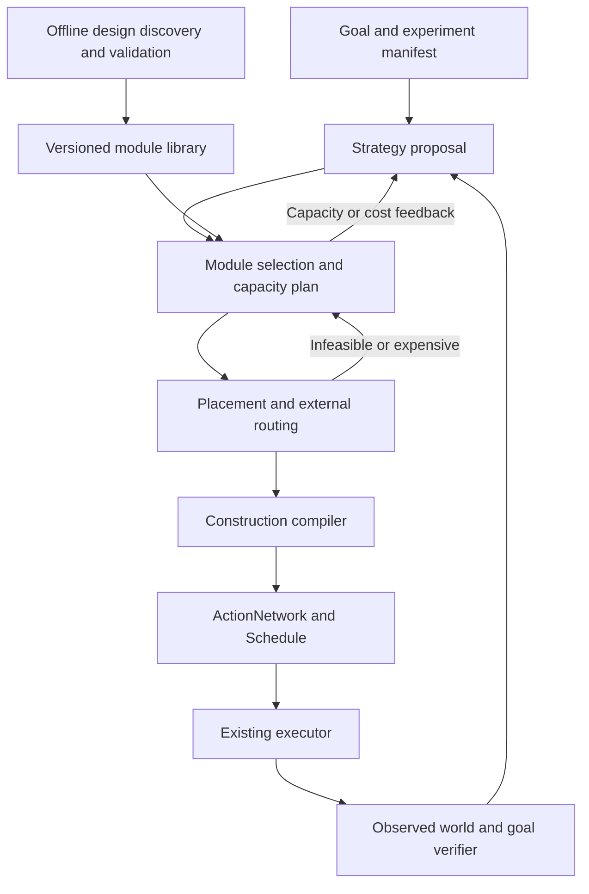

# Hierarchical factory planning with reusable modules

Date: 2026-09-10

Status: draft for written review; implementation not started.

Source baseline: `82c22eee`. The owner approved the architectural direction in
conversation and requested this Superpowers spec. The detailed contracts and
rollout below are proposals for review.

## 1. Outcome and scope

Build a research platform that can turn a high-level Factorio Space Age goal
into production investments, spatial factory structure, and coordinated bot
work, while making planning cost and the contribution of prior knowledge
measurable.

The eventual performance objective is minimum actual game ticks to a declared
terminal condition on a given map, under declared computation and observation
rules. Creating a first platform, operating a space-science factory, and
completing Space Age are separate terminal conditions. Creating a platform does
not satisfy the other two.

The first implementation project is deliberately narrower: explicit reusable
modules for existing starter production, bounded planning, and an experiment
comparing the current planner with a module-backed planner. This document
defines that project's requirements and the architectural contracts for later
projects. Each later project requires its own detailed spec and implementation
plan; this document does not authorize one large whole-game rewrite.

### Success means

- A successful plan produces an executable construction schedule and explicit
  operating obligations, rather than merely describing machines that could run.
- Reusing a design avoids repeating its internal synthesis and validation while
  still checking its placement, external connections, and current operating state.
- Planning and recovery terminate within declared budgets, with a usable
  incumbent when one exists and an explicit outcome otherwise.
- Experiments separate supplied knowledge, discovered knowledge, planning
  computation, and actual game performance.
- Researchers can replace module generation, selection, siting, or scheduling
  through stable artifact boundaries.

### Outside the first implementation project

Whole-game optimality, a new global solver, arbitrary blueprint synthesis,
learned policies, a general factory simulator, UI redesign, interplanetary
execution, hostile-mode strategy, trains, quality optimization, and beacon
optimization. These are unsupported capabilities or future projects, not
implicitly modeled as free or irrelevant.

## 2. Existing foundations and limitations

The current code already supplies much of the execution foundation:

| Existing component | Role in this design |
|---|---|
| `goal.rs`, `method/mod.rs` | Existing goal interface and primitive expansion |
| `method/produce.rs`, `method/assemble.rs` | Initial module families to extract |
| `method/blueprint.rs` | Construction and siting machinery to reuse where compatible |
| `method/connect.rs`, `pipe.rs`, `power.rs` | External connection and supply validation |
| `network.rs`, `schedule.rs` | Primitive dependency graph and baseline scheduling |
| `memory.rs`, `standing.rs` | Intent recovery and standing-world reconstruction |
| `report.rs`, core `plan_work.rs` | Reports and deterministic work counters |
| Executor and run records | Execution, observations, and independent outcome evidence |
| `search.rs` | Initial generator/evaluator experiments, with restricted model coverage |

At the source baseline, `plan_best` compares drain policies, not arbitrary
strategies. Expansion rehearses demand before expanding the executable network.
Assembly siting searches positions and orientations of generated shapes, taking
the first feasible candidate. Scheduling scans remaining work and evaluates
candidate assignments with state forks and pairwise lookahead.

There is also a recursive tile-conflict retry before the separately bounded
retry loop in `lib.rs`. The recursive call carries no retry depth. Budget
propagation must cover this path; the presence of a bounded loop elsewhere is
not evidence that planning is bounded.

The exploratory flow evaluator has documented coverage limits, including fuel
and multi-output behavior. It cannot certify arbitrary modules. Neither an
estimated rate nor `Goal::Producing`'s structural satisfaction is an independent
measurement of sustained production.

These observations identify design constraints, not a measured attribution of
the owner's slowdown. Phase 0 measures the current implementation before
selecting performance remedies.

## 3. Approaches considered

1. **Explicit modules over the existing planner — selected.** Extract existing
   designs into a shared representation, retain execution and recovery, and add
   bounded selection and evaluation. This permits controlled comparisons and
   later synthesis without requiring a new solver first.
2. **A library of optimized blueprint strings alone.** Cheap to introduce, but
   insufficient for startup cost, supply contracts, construction sequencing,
   incomplete builds, and fair evaluation of learned knowledge. Blueprint
   imports remain a possible source of module geometry.
3. **Joint whole-game search over actions and every entity position.** Maximally
   expressive, but couples strategy, geometry, allocation, and timing before
   there is a validated cost model or tractable baseline. Reserved for small
   exact benchmark problems, not the main architecture.

## 4. Architecture and ownership

These are logical interfaces, initially implemented inside the existing Rust
crates. Do not create separate services or a generic plugin framework in phase 1.

- **Strategy:** chooses investment timing and dependencies toward the terminal
  goal. Phase 1 uses an explicit milestone policy, recorded as prior knowledge.
- **Module selection:** chooses design variants and capacity counts, accounting
  for standing capacity and startup requirements.
- **Placement/routing:** places module instances on an explicitly named surface
  and establishes external connections. Returns alternatives or typed failures.
- **Construction compiler:** refines selected instances into existing actions,
  including acquisition, configuration, access, and commissioning work.
- **Scheduler:** assigns primitive work while respecting ownership and temporal
  dependencies. The current scheduler remains the initial implementation.
- **Verifier:** reads game observations to evaluate terminal goals and operating
  claims. It does not accept planner success as evidence of game success.

Logical separation does not imply irreversible sequential decisions. A route
failure can reject an instance placement; an expensive placement can reject a
module choice. All alternatives share one planning budget.

The phase-1 extension boundaries use owned, versioned artifacts rather than
exposing mutable expansion internals:

| Operation | Input | Output |
|---|---|---|
| Generate candidates | Production request, compatibility context, library, budget | Ordered design IDs and parameters, or typed rejection |
| Instantiate | Design, surface snapshot, placement constraints, budget | Placed instance candidates with bound ports and obligations |
| Compile | Selected instances, observed inventories and roster, budget | Action network, instance/action provenance, operating obligations |
| Schedule | Action network, observed state, roster, budget | Schedule and cost estimate, or typed rejection |
| Verify | Terminal predicate, instance provenance, observation interval | Achieved, not achieved, or unknown, with supporting observations |

Candidate records include their assumptions and model coverage. Discovery can
produce the same design artifact offline; no Python/Rust FFI or remote protocol
is required in the first project.

## 5. Reusable module contract

### 5.1 Identity and artifact

Introduce a serializable, versioned `ModuleDesign` representation. Exact Rust
field layouts are an implementation-plan concern; the required semantics are:

| Field group | Required information |
|---|---|
| Identity | Stable content hash, schema version, family and generator version |
| Provenance | Handwritten, imported, extracted, or discovered; parent designs; training manifest if applicable |
| Compatibility | Relevant prototype/recipe fingerprint, mod set, research and surface requirements |
| Parameters | Typed values, units, legal ranges, and supported transforms |
| Geometry | Relative entity positions, directions, recipes/settings, collision footprint |
| Reserved space | Required access and connection corridors; optional expansion space kept separate |
| Ports | Stable IDs, substance, direction, location, lane/fluid constraints, conditional capacity |
| Startup | Bill of materials, initial ingredients/fuel, dependencies, construction precedence |
| Operation | Input consumption, output production, power/fuel demand, storage and byproduct constraints |
| Evidence | Validation level, fixture IDs, measured operating conditions, model error and unsupported capabilities |

Prototype data is authoritative for physical and recipe values. Human choices
such as a corridor width or preferred topology are explicit design parameters.
Unsupported blueprint fields cause a named rejection, not silent data loss.

Geometry is bot-independent. Construction precedence is a partial order; final
bot assignment and absolute action times are computed for the current world.
Internally independent sections can be commissioned before the entire module
is complete if their dependencies establish that this is valid.

### 5.2 Capacity is conditional

A contract means: given these inputs, power, fuel, output capacity, technology,
and startup state, this module is predicted to provide this output. It is not
an unconditional rate attached to a machine count.

Represent startup delay and the distinction between finite stock and continuing
supply. Track simultaneous multi-output behavior, shared input capacities, and
storage saturation whenever a module uses them. A model that does not support
a required mechanism returns `UnsupportedModel`; it must not produce a trusted
score for that module. Phase 1 excludes unsupported module families.

Manual fueling or feeding is allowed when explicitly represented as recurrent
work with materials, access, and bot-time costs. It must not be presented as
autonomous supply. A supplied buffer covers only its derived operating interval.

For each consumer horizon, verify that the same source output has not been
promised twice and that material delivery and downstream drainage remain
feasible. Structural capacity, model-predicted output, and observed output are
three separate report fields.

### 5.3 Placed instances

`ModuleInstance` is distinct from `ModuleDesign` and records:

- Unique instance ID, design hash, parameters, surface ID, anchor, orientation.
- Bound ports and reservations for shared supplies, power, and route capacity.
- Intended entities and current observed construction/configuration state.
- Remaining construction work and commissioning state.
- Predicted operation and observation-backed validation state.

Use existing replan memory as the integration point. Intent is advisory until
matched against the observed world. Two instances sharing a sub-layout remain
distinct; recovery must not infer identity solely from a geometry match.
Missing observations mean unknown, not destroyed, complete, or productive.

### 5.4 Reuse and invalidation

Separate three caches:

1. **Design artifact:** keyed by generator/version, normalized parameters, and
   relevant prototype/recipe dependencies; contains local geometry and contract.
2. **Design validation:** keyed by design hash and the tested operating model,
   scenario, and conditions; reusable only under matching assumptions.
3. **Placement feasibility:** scoped to an observed-world revision and instance
   transform. Phase 1 conservatively invalidates this cache on world changes;
   finer dependency invalidation is a later optimization.

Never cache a complete bot schedule as a reusable design. Inventory, ownership,
terrain, research, or neighboring entities can invalidate a previous schedule.
A cache hit still requires applicable site, external-route, and supply checks.

## 6. Planning behavior and budgets

### 6.1 Phase 1 behavior

Preserve existing Lua goals and add explicit planner-mode selection in the
research runner. The existing mode remains the default during evaluation.
The experimental module mode handles its declared module-backed production
subset and uses existing primitive methods for acquisition and construction.
It must report any fallback; it cannot silently substitute a different library
or treat an unsupported goal as satisfied.

Select a small deterministic set of module candidates. Apply cheap compatibility
and footprint checks before expensive routing and scheduling. Schedule feasible
refinements and retain the best according to the experiment objective. Stable
content IDs break ties. A throughput-per-plate ranking may shortlist candidates
but cannot decide a completion-time experiment by itself.

The first release still refines a complete small milestone. It does not claim
whole-game planning scalability from module reuse alone.

### 6.2 Budget contract

A `PlanningBudget` belongs to the top-level request and is shared by expansion,
placement, routing, scheduling, policy alternatives, and recovery retries.
Nested calls cannot reset it.

Record limits and consumed work for expanded goals, candidate sites, routing
expansions, candidate assignments, and conflict retries. Existing counters
remain diagnostic; add counters where work is currently invisible. Cooperative
checks occur inside long loops, not only between completed plans.

Two modes serve different experiments:

- **Deterministic budget:** fixed work limits and stable ordering; repeated
  inputs, including initial cache state, produce the same result. Wall time is
  measured separately.
- **Deadline budget:** also obey a wall-time deadline supplied by the outer
  runner. Timing-dependent output is expected and recorded. The pure planner
  receives cancellation checks rather than owning the system clock.

Outcomes distinguish `CompletePlan`, `BudgetExhaustedWithIncumbent`,
`BudgetExhaustedWithoutPlan`, `Infeasible`, and `Unsupported`. An incumbent is a
fully validated and scheduled plan for the requested phase-1 milestone; a
partially constructed search candidate is not an incumbent. If none exists,
return the reason and consumed budget rather than hanging or claiming success.

Every tile-conflict retry consumes a retry unit. Repeating the same conflict
against unchanged reservations terminates with a no-progress failure. Cache and
retry counters make this observable.

### 6.3 Later refinement over a moving horizon

The later strategic planner retains a coarse plan to the terminal goal while
compiling only the upcoming construction window. The coarse plan records
capacity investments, material commitments, dependencies, and future site and
transport reservations. This prevents local choices from occupying land or
spending materials required by already selected future investments.

The executable window ends at a valid commissioning boundary and includes
operating support until the next planned opportunity to refresh it. Replanning
accounts for in-flight actions and confirmed effects. Freeze dispatched work;
revise undispatched work. Replan on material model divergence, task completion,
loss of supply, or a declared horizon boundary, with hysteresis to prevent
thrashing. Detailed concurrency and terminal-value policies belong to the
moving-horizon project's spec.

## 7. Toward fast runs

The speedrun objective is actual elapsed game ticks to the declared terminal
condition. Reliability is a reported outcome and feasibility requirement, not
a hidden penalty chosen after seeing results. Planning computation is either a
separate constrained resource or included through unpaused execution, as the
experiment manifest declares.

The later strategy model must account for material balance over time, when new
machines become productive, construction costs, finite inventories, research
prerequisites, and bot availability. Steady-state production balance alone
cannot choose between a cheap early factory and an expensive late one.

Retain multiple useful designs across construction cost, startup delay, rate,
footprint, and port topology. Dominance comparisons are valid only under
equivalent operating and connection assumptions. Do not discard a design just
because its headline throughput is lower.

Use the current scheduler as a feasible baseline. Compare bounded local search
or constraint programming on small scheduling problems before adopting a new
solver. Geometry and material estimates must feed back into strategic costs.
Use actual game rollouts to validate finalists; model scores never substitute
for terminal-condition observations.

For small problems, measure gaps against exact restricted solutions or valid
optimistic relaxations. Record the restrictions and bound assumptions. A bound
on one action graph or one module library is not a whole-game optimality bound.
For larger problems, report best-known same-rules results without claiming a
known distance from the global optimum.

## 8. Research interfaces and experimental design

### 8.1 Tracks

| Track | Allowed reusable knowledge | Claim it can support |
|---|---|---|
| Existing baseline | Current methods, shapes, and heuristics, frozen at a revision | Engineering baseline; not a primitive-only agent |
| Fixed modules | Identical versioned module library and generator access | Selection, composition, placement, and coordination |
| Discovered modules | Library produced under a declared training budget | Abstraction discovery, reuse, and held-out transfer |
| Primitive-only, later | Explicit primitive vocabulary and game data, without module access | Layout synthesis from that vocabulary |

The fixed and discovered tracks must expose the same execution capabilities.
The discovery generator or grammar is itself prior knowledge and is recorded.
Parameter search inside a handwritten family is labeled parameter optimization,
not invention of arbitrary topology. Imported expert blueprints are labeled as
such and appear in a separate baseline or shared fixed library.

Freeze training libraries before held-out transfer evaluation. Online adaptation
is a separate condition with its own budget and artifacts. Test maps cannot be
used to tune a library or choose favorable budget settings for the transfer
claim. Full-map visibility and explored-only visibility are separate conditions.

### 8.2 Manifest and record

An experiment manifest fixes game/mod/prototype versions, initial save or map
generation settings, seed, starting inventories, bot roster, terminal predicate,
map visibility, enemy settings, game speed, pause policy, action capabilities,
reset policy, planner revision, library hash, budget, and hardware description.
Missing required provenance makes a trial invalid rather than equivalent to a
default setting. Primitive capabilities include reach, movement, placement, and
inventory transfer semantics; a blueprint must not imply free construction.

Record:

- Terminal outcome: success, failure, timeout, unsupported, or invalid trial.
- Actual game ticks, planning wall time by phase, total wall time, and work counts.
- Time to first feasible plan and incumbent improvements versus consumed budget.
- Module generation, cache hits, site attempts, routing work, and retries.
- Predicted versus observed milestone time, startup time, and production rates.
- Replans, failed actions, manual operating work, and duplicated construction.
- Training compute and simulation calls separately from per-episode compute.

Evaluate success over all declared trials. Compare completion time on paired
successful trials and separately report censored timeouts/failures; do not make
an unreliable planner appear faster by dropping its failed seeds.

### 8.3 First benchmark suite

Phase 0 checks in a manifest containing seeds `31337`, `104729`, `130363`,
`155921`, `196613`, `262147`, `327673`, `393241`, `458879`, and `524287`.
These are proposed fixed cases, not seeds selected for favorable terrain.
Seed 31337 is a development/diagnostic case, not evidence of held-out transfer.
Preserve full map-generation settings and initial inventories. Use peaceful
Nauvis, explored-only observations, and
rosters of 1 and 4 bots. Larger rosters and other observation/enemy settings are
later experiment extensions. All variants start from identical per-case saves.

Use two task tiers:

1. **Compatibility control:** research automation from the initial state, using
   its actual researched flag as the terminal condition.
2. **Module task:** build red-science production from the initial state with
   observation-based inserter delivery of at least 6 packs/minute into the
   declared lab sink in each of five consecutive 3,600-tick windows, aligned to
   the recorded commissioning tick. Machine attribution and
   commissioning records exclude hand-crafted packs and preloaded science from
   this measurement. Startup time counts toward completion; underlying plate,
   fuel, and power supply must be costed. The manifest fixes the research sink
   policy identically for both planner modes.

The second tier is intentionally finite: it establishes five minutes of
production, not indefinite sustainability. Green science is the next capability
gate, added only once its full ingredient and operating obligations are
represented. Failed current-baseline trials remain in the results.

If the declared lab sink cannot accept the target output for the full interval
under legitimate research progression, phase 0 must correct and freeze the task
manifest before comparison; it cannot alter sink behavior for only one variant.

Structural fixtures additionally cover blocked ports, scarce power, competing
consumers, and interrupted construction. They are correctness cases, not
substitutes for from-start execution trials.

## 9. First implementation project and acceptance gates

### Phase 0 — Freeze and measure the baseline

- Pin the source revision, game data, snapshots, and benchmark manifest.
- Measure loading, expansion/rehearsal, placement/routing, scheduling, and
  recovery separately on successful and failed cases.
- Establish counter coverage and baseline artifacts. No timing claim relies on
  old prose or compares different build profiles.
- Add shared planning budgets and no-progress retry termination. Verify the
  recursive conflict path is covered. Treat scheduler/cache optimizations as
  separate measured changes, not prerequisites assumed to be effective.

Keep the original measurements as historical evidence. Freeze the comparative
baseline after shared budget/measurement changes, before module extraction;
both modes receive identical safety and verification behavior. Record both
revisions so budget fixes cannot be attributed to module reuse.

Acceptance: every trial terminates with a named outcome; planning budget tests
cover nested retries; baseline results can be regenerated or report missing
fixtures explicitly. A missing fixture is not a passing measurement.

### Phase 1 — Explicit fixed modules

- Add the module artifact, instance identity, port and operating contracts,
  candidate/validation interfaces, and conservative caches inside `crates/planner`.
- Extract the existing ore-to-plate and red-science assembly families. Reuse
  existing power construction and connection methods; record their costs and
  obligations rather than introducing a general power-module library now.
- Adapt construction into existing action networks and scheduler; preserve
  inventory ownership, research gates, route checks, and placement semantics.
- Persist instance identity and intended connections through existing memory.
- Add experimental mode/library selection and manifest/report support through
  the existing CLI/Lua research runner. Existing scripts retain their behavior.

Acceptance:

1. Extracted fixed designs reproduce their source geometry, settings, required
   clearance, and bills for the supported parameter combinations.
2. Every supported rotation preserves port and belt-lane semantics; unsupported
   transforms reject explicitly.
3. Two instances cannot double-claim source throughput, power, or the same site.
4. An interrupted build resumes the same instance without duplicating its
   entities or mistaking a neighboring similar design for it.
5. Design reuse survives a map change, while obsolete placement feasibility is
   invalidated; changed prototype assumptions invalidate affected contracts.
6. A missing fuel supply, blocked output, or unobserved operating state cannot
   satisfy the observed production task.
7. Bounded planning yields deterministic results under work limits and named
   cancellation outcomes under deadlines.
8. Module mode and baseline produce complete experiment reports, including
   failures and unsupported cases. Performance gains are findings, not fabricated
   release requirements.

### Phase 2 — Reuse experiment and decision

Run paired baseline/module trials on the frozen suite. Add a module-cache-off
ablation with identical candidate order and budgets. Separate warm library use
from cold artifact construction, charging each according to the manifest.
Compare success, actual completion ticks, planning work, wall time, and model
error. Timing runs execute without competing benchmark workloads on the same
hardware and include three repeats per case; retain every repeat.

Acceptance: publish the paired data and an evidence-backed decision about the
next bottleneck. Continue toward learned modules if reuse is correct and useful;
if it offers little benefit, distinguish poor cache hit rate, expensive siting,
scheduling overhead, and operating-model errors before extending the system.
The initial project is complete when this comparison is reviewable, even if the
experimental planner does not win.

The full matrix is an explicit experiment, not a per-commit test. First run a
seed-31337/four-bot smoke comparison and correctness fixtures. The experiment
runner prints the complete matrix and its configured trial-time ceiling before
execution. The manifest must bound both per-trial game ticks and total wall
time; unfinished trials become recorded timeouts, with no replacement seeds.

## 10. Follow-on projects

Ordered by dependency, each with a separate detailed design:

1. **Module portfolio and discovery:** search within a declared grammar, validate
   designs under varied operating conditions, retain useful variants, and
   evaluate frozen libraries on held-out maps. Start with parameter variants;
   add topology changes only when the evaluator supports them.
2. **Strategic investment and moving-horizon planning:** choose capacity and
   research timing with a long-range coarse plan and short executable windows.
   Compare against the frozen milestone policy and account for startup costs.
3. **Scheduling improvement:** use profiling and critical-path evidence to select
   a bounded optimization method, comparing against the existing scheduler on
   identical construction problems. Can proceed independently after the phase-1
   artifact boundary is stable.
4. **Rocket and platform progression:** extend module coverage to fluids and
   their coupled outputs, advanced intermediates, silo operation, and a verified
   first platform. Then specify multi-surface supply, transport, and operation
   before attempting later Space Age milestones.

Quality, spoilage, planetary constraints, and transport latency must enter
contracts before using families that rely on them. Unknown support is an
explicit refusal, never a silent optimistic score.

## 11. Risks and mitigations

| Risk | Design response |
|---|---|
| Reuse hides supplied expertise | Version and disclose every library/generator; separate tracks |
| More library entries increase search cost | Compatibility filtering, bounded candidate portfolio, measured retrieval cost |
| Good local modules compose badly | Explicit ports, route reservations, supply accounting, feedback to selection |
| High steady throughput loses the speedrun | Time-dependent startup/investment costs and actual terminal ticks |
| Optimizer exploits model omissions | Capability-gated evaluator, stated assumptions, independent live verification |
| Replanning repeats or abandons construction | Instance IDs, observed reconciliation, no-progress detection |
| Abstraction hides scheduling opportunities | Partial construction order and independently commissionable sections |
| Short horizons underinvest or block future space | Coarse terminal plan and explicit future commitments in the later horizon design |
| Broad scope delays useful evidence | Starter-family extraction and paired experiment are the first complete project |

## 12. Research context

The following motivate the architecture; their results are not claims that this
Factorio implementation will achieve the same performance:

- [Hierarchical Task and Motion Planning in the Now](https://people.csail.mit.edu/tlp/pdf/2011/hpnICRA11Final.pdf):
  hierarchical refinement of long tasks with geometric constraints.
- [PDDLStream](https://arxiv.org/abs/1802.08705): symbolic planning integrated
  with specialized procedures for constrained geometric choices.
- [Learning Neuro-Symbolic Skills for Bilevel Planning](https://arxiv.org/abs/2206.10680):
  reusable skills combining operators, policies, and samplers.
- [DreamCoder](https://arxiv.org/abs/2006.08381): learning reusable program
  abstractions rather than repeatedly solving from primitives.
- [FLE multi-agent release](https://jackhopkins.github.io/factorio-learning-environment/versions/0.2.0.html):
  existing multi-agent Factorio research; concurrent physical coordination and
  Space Age completion efficiency need to be evaluated as specific distinctions.
- [OR-Tools job-shop scheduling](https://developers.google.com/optimization/scheduling/job_shop):
  a possible foundation for bounded scheduling experiments, requiring additional
  Factorio-specific material and travel constraints.

## 13. Review and implementation boundary

Review this written design before producing the phase 0–2 implementation plan.
The recommended decisions are: incremental extraction, explicit conditional
contracts, a shared planning budget, an unchanged baseline mode, and a frozen
starter-production comparison before learned design or global optimization.
No performance percentage or whole-game completion guarantee is asserted.
